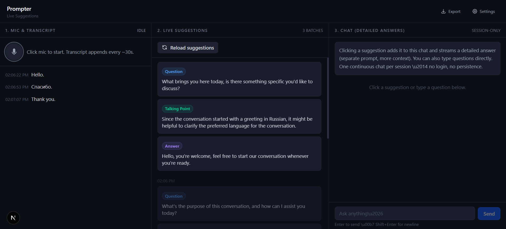

# Prompter — Live Meeting Suggestions

An AI meeting copilot that listens to your mic, transcribes speech in real time, and surfaces 3 contextually-aware suggestions every 30 seconds. Click any suggestion for a detailed answer, or type questions directly into the chat panel.



---

## Setup

### Prerequisites
- Node.js 18+
- A [Groq API key](https://console.groq.com) (free tier is sufficient)

### Run locally

```bash
git clone <your-repo-url>
cd prompter
npm install
npm run dev
```

Open `http://localhost:3000`, click **Settings**, paste your Groq API key, and save. Then click the mic to start.

### Deploy to Netlify

Push to GitHub, then connect the repo in the [Netlify dashboard](https://app.netlify.com). Netlify auto-detects Next.js. Use these build settings if not detected automatically:

| Setting | Value |
|---|---|
| Build command | `npm run build` |
| Publish directory | `.next` |

No environment variables needed — the API key is entered by the user at runtime and stored in their browser's `localStorage`.

---

## Stack

| Layer | Choice | Reason |
|---|---|---|
| Framework | Next.js 16 (App Router) | Handles frontend + API routes in one repo. Deploys to Netlify with no config. |
| Transcription | Groq — `whisper-large-v3` | Fastest Whisper inference available. Handles accents and noisy audio well. |
| LLM | Groq — `llama-3.3-70b-versatile` | Strong reasoning, fast inference on Groq, good JSON output for structured suggestions. |
| Styling | Tailwind CSS v4 | Utility-first, no runtime overhead, dark theme is trivial. |
| State | React `useState` + `useRef` | No external state library needed — all state is session-local and linear. |
| Persistence | `localStorage` | Settings (API key, prompts) persist across refreshes. Session data (transcript, chat) is intentionally ephemeral. |

---

## How it works

```
Mic → MediaRecorder (30s chunks) → /api/transcribe (Whisper) → transcript chunks
                                                                      ↓
                                                         /api/suggestions (LLM)
                                                                      ↓
                                                            3 suggestion cards
                                                                      ↓
                                               click → /api/chat (streaming LLM)
```

Audio is captured via the browser `MediaRecorder` API in 30-second cycles. Each chunk is sent to the transcription API route, which proxies to Groq Whisper. As soon as a transcription chunk lands, suggestions are fetched immediately — not on a fixed timer — so the first batch appears as soon as the first chunk is transcribed (~30s after recording starts).

---

## Prompt strategy

### Live suggestions

The suggestion prompt is the core of the product. My approach:

1. **Recent context only** — I pass the last N transcript chunks (default: 5, ~2.5 minutes) rather than the full transcript. The model performs better with focused recent context than with a long history it has to search through.

2. **Type selection is guided, not forced** — The prompt defines four types and explains *when* each is most useful:
   - `answer` — when a question was just asked and wasn't answered
   - `fact-check` — when a specific factual claim was just made
   - `question` — when the conversation needs deeper exploration
   - `talking-point` — when useful context hasn't been raised

   The model picks whatever the conversation actually needs. This produces better suggestions than asking for "one of each type" every time.

3. **Preview must standalone** — The prompt explicitly instructs that each preview (1–2 sentences) should deliver value even if never clicked. This keeps suggestions useful at a glance, not just teasers.

4. **JSON mode** — The suggestions API uses `response_format: { type: 'json_object' }` to guarantee parseable output without post-processing.

### Detailed answers (on click)

When a suggestion is clicked, a separate longer-form prompt is used with:
- The full conversation transcript (last N chunks, default: 10)
- The suggestion type and preview as explicit context
- An instruction to ground the answer in what was actually said

This is a deliberately different prompt from the chat system prompt — it's more structured and retrospective, whereas chat is conversational.

### Chat

The chat system prompt injects the recent transcript as context so the assistant can answer questions grounded in what was actually said, not just general knowledge.

---

## Tradeoffs

**Chunking at 30s vs. streaming transcription**
I use 30-second `MediaRecorder` chunks rather than streaming audio. Streaming would give lower latency but requires a persistent server connection and more complex state management. For a meeting copilot, 30s latency on transcript is acceptable — suggestions don't need to be word-for-word real-time.

**Suggestions triggered by transcription, not a fixed timer**
The auto-refresh countdown (visible in the UI) is a visual indicator, but suggestions are actually fetched right after each transcription chunk lands. This avoids the race condition where the countdown fires before the transcription response has returned.

**API key on the client**
The Groq key is stored in `localStorage` and sent as a request header to the Next.js API routes, which proxy to Groq. The key is never hardcoded or logged. This is appropriate for a personal tool — for a multi-user product you'd use server-side auth instead.

**No markdown rendering in chat**
Chat responses render as plain text with `whitespace-pre-wrap`. Adding a markdown renderer (e.g. `react-markdown`) would improve readability of structured answers, but adds a dependency. Easy to add if needed.

**Session-only data**
Transcript, suggestions, and chat are in-memory only and lost on page reload. The export button covers the data recovery use case without needing a backend or database.

---

## Settings

All prompts and context window sizes are editable in the Settings panel at runtime. Defaults are hardcoded to values I found work well across a range of meeting types. The model ID is also configurable if you want to try other Groq-hosted models.

| Setting | Default | Notes |
|---|---|---|
| Model | `llama-3.3-70b-versatile` | Any Groq chat model works |
| Suggestion context | 5 chunks | ~2.5 minutes of speech |
| Chat context | 10 chunks | ~5 minutes of speech |

---

## Export format

The export button downloads a timestamped JSON file:

```json
{
  "exportedAt": "2026-04-18T10:00:00.000Z",
  "transcript": [
    { "timestamp": "...", "text": "..." }
  ],
  "suggestionBatches": [
    {
      "timestamp": "...",
      "suggestions": [
        { "type": "question", "preview": "..." }
      ]
    }
  ],
  "chat": [
    { "role": "user", "content": "...", "timestamp": "..." },
    { "role": "assistant", "content": "...", "timestamp": "..." }
  ]
}
```
